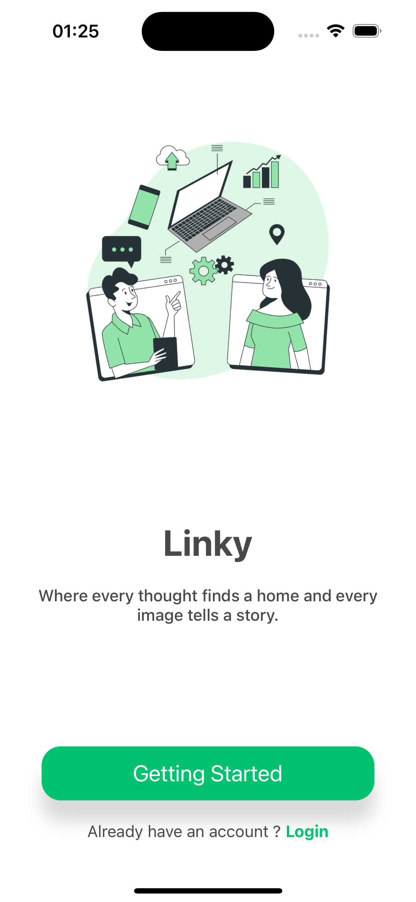
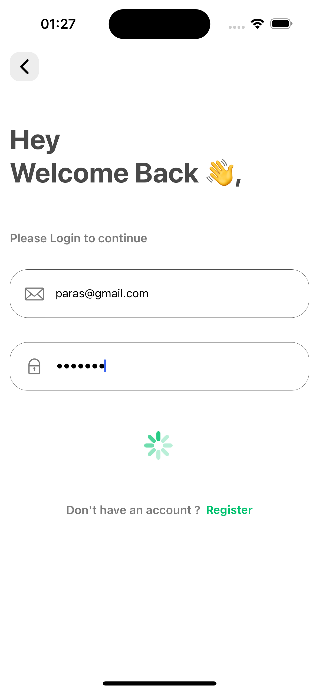
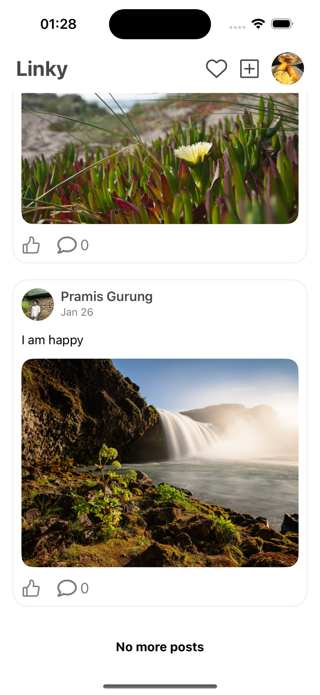
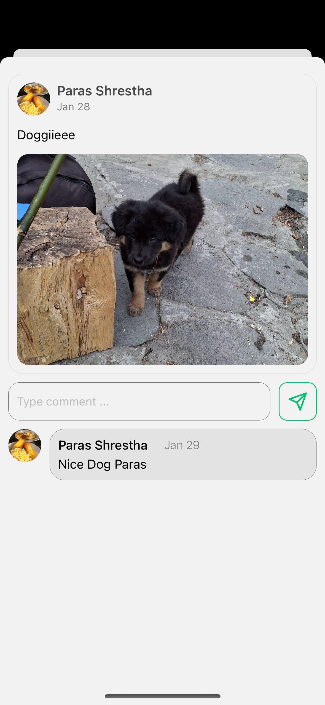
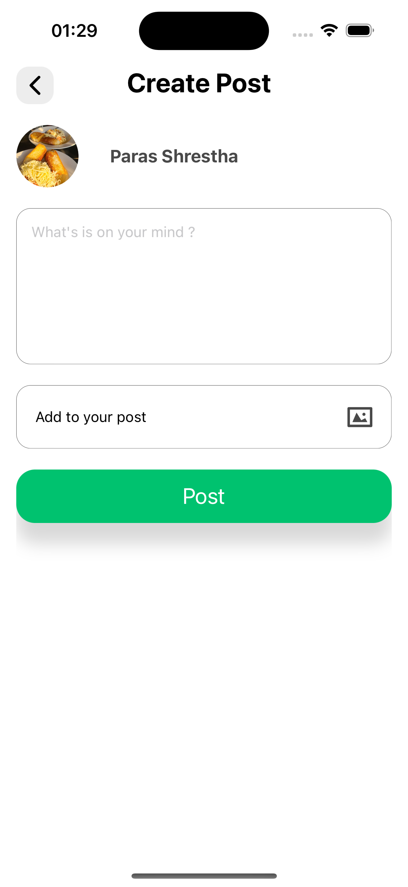
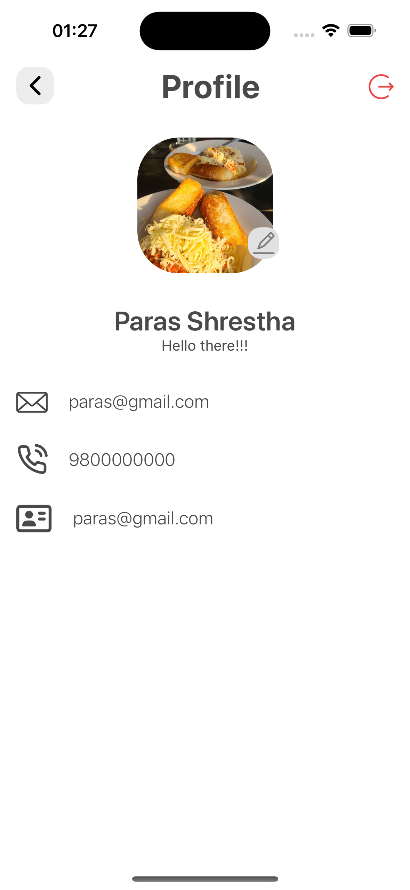
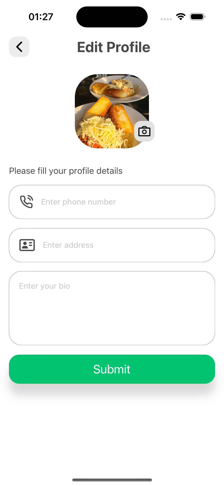

# Linky 👋

A social media platform for sharing images, posting statuses, and engaging through comments.

## Tech used

Made with ❤️ using react native and supabase.

## Snapshots

### Welcome Screen

### Login Screen

### Home Screen

### Post Details Screen

### Create Post Screen

### Profile Screen

### Edit Profile Screen

